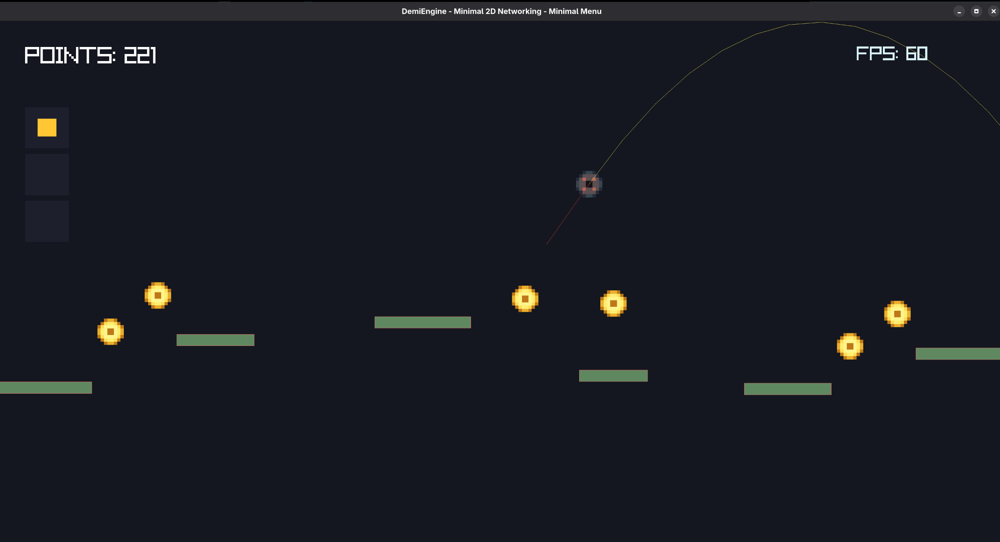
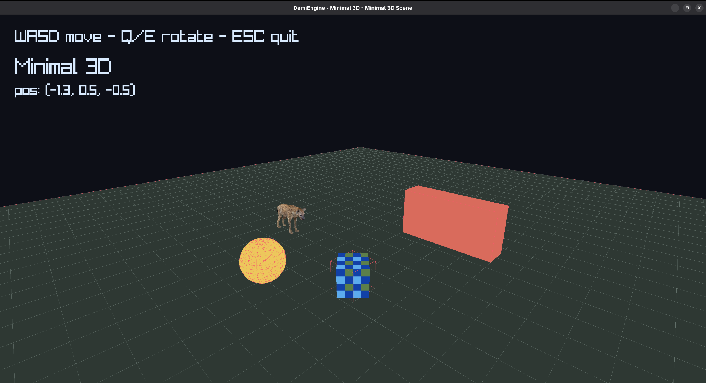
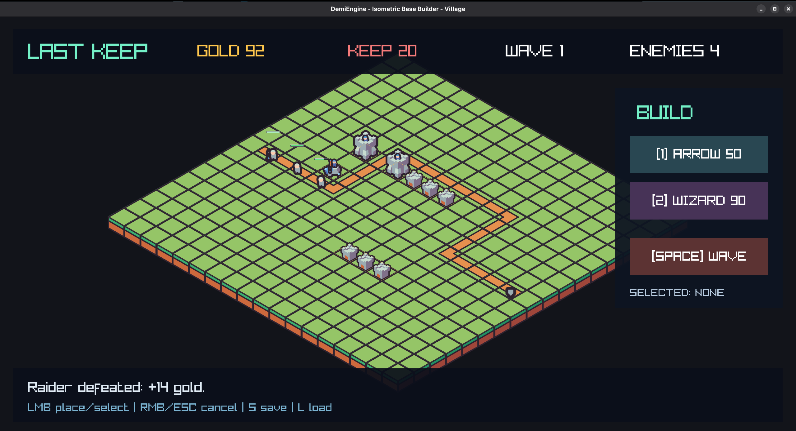
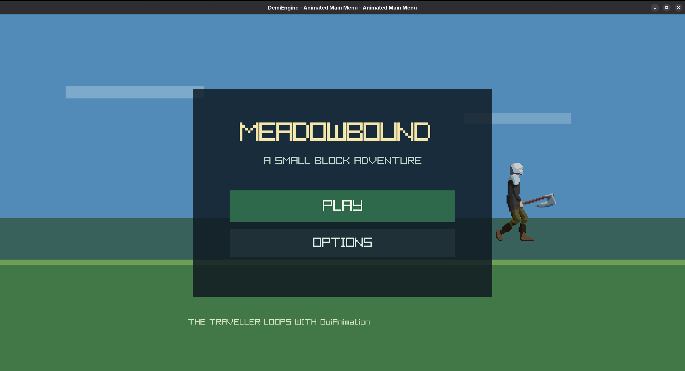
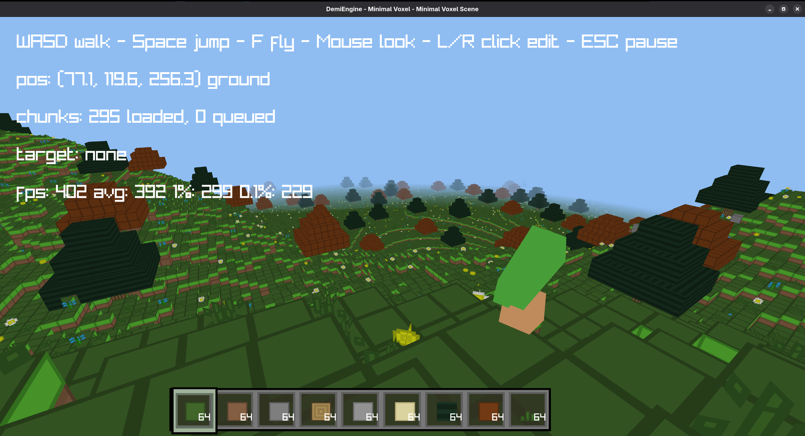
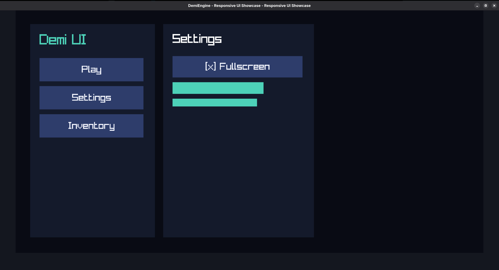

# DemiEngine

DemiEngine is a Linux-first C++20 game engine for deterministic, text-authored game development. It combines JSON project data, Lua gameplay scripting, a unified command-line workflow, and playable reference projects without relying on hidden editor state.

Linux is the primary supported desktop platform. Android support is experimental but functional: the same DemiEngine project can be built as a Linux executable or Android APK without changing the project code.

```bash
demi build linux
demi build apk
demi run linux
```

The runtime can load JSON projects and scenes, run Lua 5.4 scripts, render 2D and lightweight 3D scenes through raylib, step 2D and 3D physics helpers, play audio and media, save versioned JSON state, run data-driven HUDs, and package projects for Linux and Android.

The editor executable currently exists as a command boundary rather than a finished graphical editor. The CLI is the primary development, validation, build, and automation interface.

## Why DemiEngine

DemiEngine is built around a few core ideas:

- Project data should be deterministic, readable, and version-controlled.
- Gameplay code should stay high-level and live in Lua.
- Building and running should use the same commands across supported targets.
- Projects should not depend on hidden editor-only state.
- Engine features should be validated through playable examples and automated tests.
- Humans and coding agents should be able to inspect, modify, validate, build, and run projects through the same workflow.

## Build And Run

DemiEngine uses a target-based CLI workflow.

Build a Linux executable:

```bash
demi build linux
```

Build an Android APK:

```bash
demi build apk
```

Run a project on Linux without creating a standalone executable:

```bash
demi run linux
```

The commands remain the same between projects. Run them from a DemiEngine project directory, or provide the relevant project path where supported by the CLI.

Android projects do not require a separate codebase. Existing DemiEngine examples and projects can be packaged as APKs directly. Runtime camera movement supports touch input out of the box. Game-specific mobile controls, such as movement buttons or touch actions, remain the responsibility of the project developer.

See `examples/minimal_2d_android` for a minimal Android-ready project.

## Current Output

The checked-in examples are playable reference projects, focused demonstrations, and integration tests for engine features. They combine JSON scenes, HUD data, Lua gameplay, rendering, physics, input, saves, networking, and platform packaging.



`examples/minimal_2d_networking` combines a data-driven HUD menu, Lua action handlers, save-backed settings, scene switching, platformer and slingshot gameplay, and optional networking paths.



`examples/minimal_3d` demonstrates the 3D renderer, scene loader, collision helpers, and Lua-controlled movement.



`examples/isometric_base_builder` is a playable minimal tower-defense and base-building game. It includes isometric rendering, grid-based construction, pathfinding, enemies, defenses, and resource management.



`examples/main_menu_animated` demonstrates a polished animated menu using `GuiAnimation` and a looping background character.



`examples/minimal_voxel` demonstrates voxel-style 3D rendering and physics integration.



`examples/ui_showcase` demonstrates data-driven UI layouts, interactive HUD elements, styling, animation, and Lua-controlled interface behavior.

## Example Projects

The examples are not throwaway snippets. They are reference projects used to exercise complete engine workflows and identify reusable features that belong in the runtime.

### Playable and game-oriented examples

- `examples/isometric_base_builder`: playable isometric tower-defense and base-building demo with construction, pathfinding, enemies, defenses, and resources.
- `examples/minimal_2d_networking`: menu flow, saves, scene switching, platformer and slingshot gameplay, plus optional networking paths.
- `examples/fighting_game_2d`: 2D fighting-game systems, data, and Lua gameplay scripts.
- `examples/minimal_voxel`: voxel-style 3D scene and physics integration.

### UI and presentation examples

- `examples/ui_showcase`: data-driven UI layouts and interactive HUD behavior.
- `examples/main_menu_animated`: animated menu built with `GuiAnimation`.
- `examples/main_menu_gif`: portrait mobile-style hub using GIF wallpaper and SVG icon assets.

### Platform and runtime examples

- `examples/minimal_2d_android`: minimal project that can be packaged directly as an APK.
- `examples/minimal_2d_android_server`: Android-oriented server or networking companion example.
- `examples/minimal_3d`: lightweight 3D rendering, scene loading, movement, and collisions.
- `examples/animation_3d`: 3D animation workflow.

When an example needs behavior that belongs in the engine, the preferred approach is to add the reusable runtime feature instead of hiding the behavior inside one project script.

## What This Engine Is

- A Linux-first C++20 game runtime.
- A functional experimental Android target using the same project code and CLI workflow.
- A Lua-driven gameplay layer with high-level engine services.
- A schema-first project format built from deterministic JSON files.
- An engine for 2D, isometric, 2.5D, UI-heavy, and data-heavy games.
- A lightweight experimental 3D runtime for small exploration, action, voxel, and puzzle projects.
- A repository designed to be changed by humans and coding agents without editor-only state.

## What This Engine Is Not

- Not a Unity clone.
- Not a finished graphical editor.
- Not a live-service backend, account system, or matchmaking platform.
- Not a high-end 3D renderer or full 3D content-authoring suite.
- Not a promise of equal support across every desktop and mobile platform.

## Current Runtime Features

- Project, scene, HUD, asset, script, and save validation through the `demi` CLI.
- Unified project build targets through commands such as `demi build linux` and `demi build apk`.
- Direct Linux execution through `demi run linux`.
- Scene loading from `*.scene.json`, including nested component data.
- HUD loading from `*.hud.json`.
- Buttons, text, rectangles, images, groups, visibility, hover state, click actions, and Lua-controlled position, size, and opacity.
- `require("demi.gui_animation")` for HUD animation scheduling.
- Native-delay GIF playback through `GifAnimation2D`.
- SVG HUD icons through `Icon2D`.
- Lua 5.4 scripting through sol2.
- Lua lifecycle functions: `on_create`, `on_start`, `on_update`, `on_fixed_update`, and `on_destroy`.
- Lua action and event annotations: `@HandleAction("...")` and `@OnEvent("...")`.
- Lua services for `Debug`, `Input`, `Timer`, `Events`, `Scene`, `Runtime`, `Entity`, `Transform2D`, `Transform3D`, `Physics2D`, `Physics3D`, `Rigidbody2D`, `HUD`, `Save`, `Audio`, `Video`, `Cutscene`, `Network`, and `NetworkSession`.
- 2D rendering, HUD rendering, debug lines, and pixel-style text rendering.
- Lightweight 3D rendering with hierarchical transforms, glTF materials and
  named skeletal clips, frustum culling, deterministic material batches,
  collision-aware movement, and Lua spatial queries.
- Box2D-backed 2D physics.
- JSON save slots with versioned migration hooks.
- Optional ENet networking when `DEMI_ENABLE_NETWORK=ON`.
- FFmpeg-backed media support when `DEMI_ENABLE_MEDIA=ON`.
- Touch camera movement on Android.

## Project Workflow

A typical DemiEngine project uses deterministic files that can be inspected and edited directly:

- Projects: `demi.project.json`
- Scenes: `*.scene.json`
- HUD files: `*.hud.json`
- Saves: `*.save.json`
- Assets: `*.asset.json`
- Lua scripts: `*.lua`

Every project, scene, save, and asset manifest should include `format_version`. Generated output belongs in `build/`, `generated/`, or `examples/**/generated/`.

Because the project state is text-based, the same workflow works well for manual development, source control, CI, and AI-assisted changes.

Assets are imported under stable `asset://` IDs, validated with the project,
and cooked before shipping. Selected assets can also be shared between
projects as deterministic `.demipack` files with transitive dependencies and
license metadata included:

```bash
demi asset import hero.png --project demi.project.json --id asset://characters/hero
demi asset export --project demi.project.json --output hero.demipack --asset asset://characters/hero
demi asset import-package hero.demipack --project ../other-game/demi.project.json
demi cook --project demi.project.json --platform linux
```

## CLI

The CLI is the main interface for building, running, validating, inspecting, and automating DemiEngine projects.

Common commands:

```bash
demi --help
demi version

demi build linux
demi build apk
demi run linux

demi validate demi.project.json
demi schema export
demi scene list demi.project.json
demi scene inspect scenes/menu.scene.json
demi save inspect saves/settings.save.json
demi script check scripts/main_menu.lua
demi lua-stubs generate generated/demi.lua
```

`demi editor --project <project>` exists as an editor command boundary. Until the graphical editor is complete, treat the CLI and deterministic project files as the primary authoring and automation contract.

## Building The Engine From Source

For engine development, use the CMake presets.

Linux debug build:

```bash
cmake --preset linux-debug
cmake --build --preset linux-debug
ctest --preset linux-debug
```

Linux release build:

```bash
cmake --preset linux-release
cmake --build --preset linux-release
```

Headless runtime smoke tests can also run the built CLI directly:

```bash
DEMI_HEADLESS=1 ./build/linux-debug/demi run --project examples/minimal_2d_networking/demi.project.json --frames 1
DEMI_HEADLESS=1 ./build/linux-debug/demi run --project examples/minimal_3d/demi.project.json --frames 1
```

These source-build commands are for developing DemiEngine itself. Game-project users should normally use the shorter target commands:

```bash
demi build linux
demi build apk
demi run linux
```

## Runtime Layout

The runtime is split by responsibility:

- `src/demi/runtime/app`: runtime loop, input polling, window setup, and subsystem orchestration.
- `src/demi/runtime/audio`: audio playback through miniaudio.
- `src/demi/runtime/media`: video and cutscene media plumbing.
- `src/demi/runtime/network`: optional network transport and session helpers.
- `src/demi/runtime/physics`: 2D and 3D movement and collision helpers.
- `src/demi/runtime/render`: 2D and 3D renderers and font support.
- `src/demi/runtime/scene`: project loading, scene parsing, HUD parsing, JSON helpers, and runtime scene data.
- `src/demi/runtime/scripting`: Lua host lifecycle, services, diagnostics, loading, persistence, and bindings.
- `src/demi/runtime/scripting/bindings`: installable Lua binding modules.
- `src/demi/runtime/scripting/persistence`: save-slot parsing and serialization.

`SceneLoader.cpp` acts as a facade, while `ProjectParser`, `SceneEntityParser`, `HudParser`, and `SceneJson` own the parsing details. Component parsing uses a strategy table keyed by component name, so adding a component does not require extending one large loader function.

Lua bindings follow the same pattern. `LuaScriptHostBindings.cpp` installs binding modules, and each module owns its API surface. Save persistence is split behind `LuaSaveCodec`, with separate parsers for current JSON saves and legacy save data.

## Dependencies

Required for the default Linux debug build:

- CMake 3.22+
- Ninja
- GCC 12+ or Clang 15+
- PkgConfig
- Lua 5.4 development files
- FFmpeg development packages when `DEMI_ENABLE_MEDIA=ON`

Fetched or linked by CMake:

- raylib 5.5: rendering, windowing, input, models, and platform layer
- Lua 5.4.7 and sol2: gameplay VM and C++/Lua bindings
- Box2D 2.4.1: 2D physics
- miniaudio 0.11.22: audio playback
- nlohmann/json 3.11.3: project, scene, HUD, asset, and save parsing
- mbedTLS 3.6.2: TLS and DTLS security
- ENet 1.3.18: optional networking when `DEMI_ENABLE_NETWORK=ON`
- FFmpeg: system media libraries when `DEMI_ENABLE_MEDIA=ON`
- librsvg: optional SVG rasterization support when available

## Scene And HUD Data

Scene components live under an entity's `components` object:

```json
{
  "id": "ent_menu_controller",
  "name": "Menu Controller",
  "components": {
    "LuaScript": {
      "module": "script://scripts/menu_scene.lua"
    }
  }
}
```

HUD button actions are plain data:

```json
{
  "type": "button",
  "id": "menu_button_network",
  "label": "NETWORK PLAY",
  "action": "menu_button_network"
}
```

Lua can bind the action with an annotation:

```lua
-- @HandleAction("menu_button_network")
function Actions.show_network()
  -- ...
end
```

## Lua API

Public Lua API stubs live in `scripts/stubs/demi.lua`.

Generate a copy for editor tooling:

```bash
demi lua-stubs generate generated/demi.lua
```

Lua scripts use explicit lifecycle functions:

```lua
local Player = {}

function Player:on_start()
  Debug.log("ready")
end

function Player:on_update(dt)
  local x, y = Input.vector("a", "d", "s", "w")
  Transform2D.add_position(self.entity_id, x * dt * 6.0, y * dt * 6.0)
end

return Player
```

Gameplay scripts should use high-level services such as `Entity`, `Transform2D`, `Transform3D`, `Network`, `NetworkSession`, `HUD`, `Save`, and `Runtime` instead of depending on raw C++ internals.

## Tests

The test suite covers validation, Lua scripting, generated stubs, scene loading, physics, networking paths, runtime smoke tests, example scripts, snapshots, replay, prefabs, tilemaps, sprite animation, UI, cameras, simulation, and isometric systems.

```bash
ctest --preset linux-debug --output-on-failure
```

Useful focused checks:

```bash
./build/linux-debug/demi-scene-loader-tests .
./build/linux-debug/demi-lua-scripting-tests
./build/linux-debug/demi-physics2d-tests
./build/linux-debug/demi-physics3d-tests
```

`demi-scene-loader-tests` guards the nested component format and HUD action loading used by the examples.

## Documentation

- [Generated documentation PDF](https://github.com/JEAPI-DEV/DemiEngine/blob/main/docs/latex/main.pdf)
- [Architecture notes](docs/architecture.md)
- [CLI notes](docs/cli.md)
- [File formats](docs/file-formats.md)
- [Capability matrix](docs/capabilities.md)
- [Compatibility policy](docs/compatibility.md)

## Development Guidelines

- Keep public APIs small and explicit.
- Prefer stable IDs and URI-style references such as `scene://main`, `asset://textures/unit.png`, and `script://scripts/player.lua`.
- Update features as a complete slice: C++ data, scene parsing, validation and schema, Lua bindings, generated stubs, and tests.
- Keep runtime data serializable. State that matters beyond one frame should usually live in scene, project, or save data rather than a hidden script global.
- Run validation after editing example data.
- Use examples to prove reusable engine features across Linux and Android rather than implementing one-off project workarounds.
