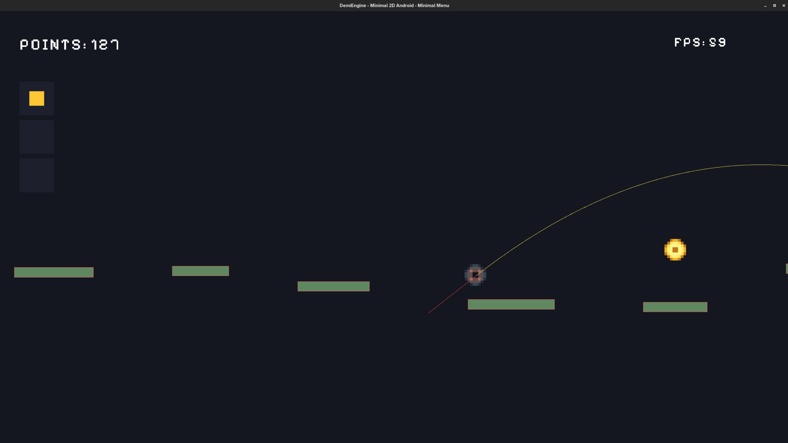
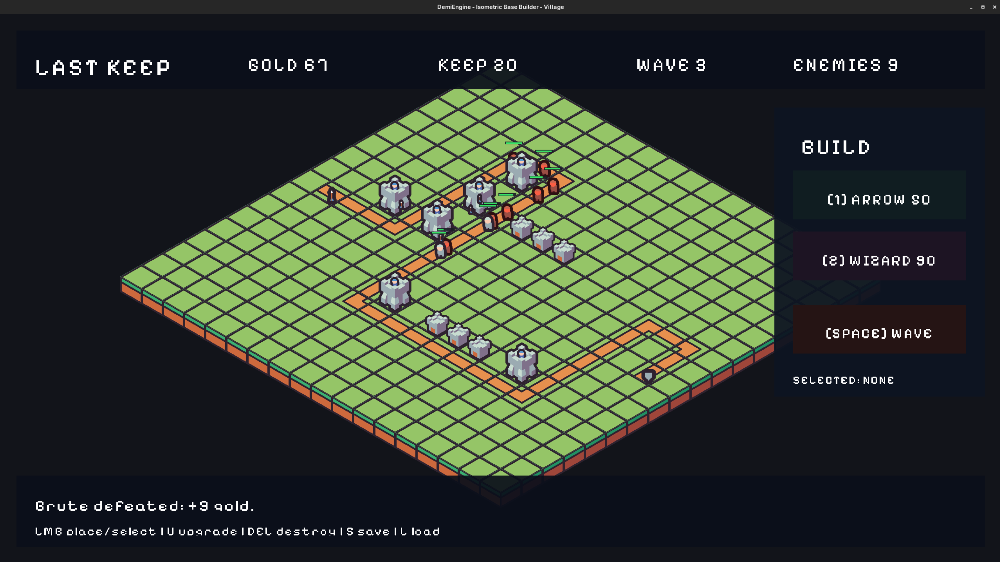
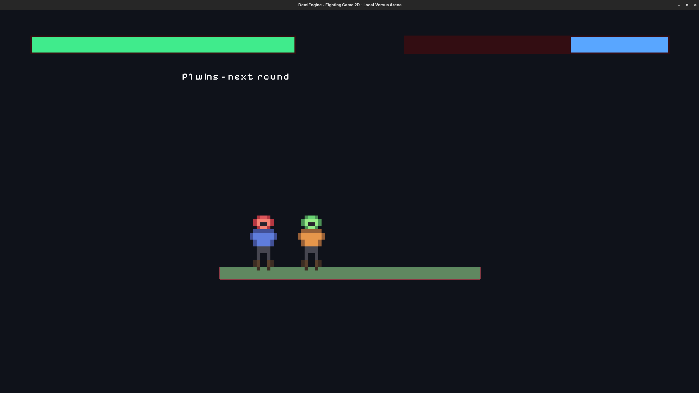
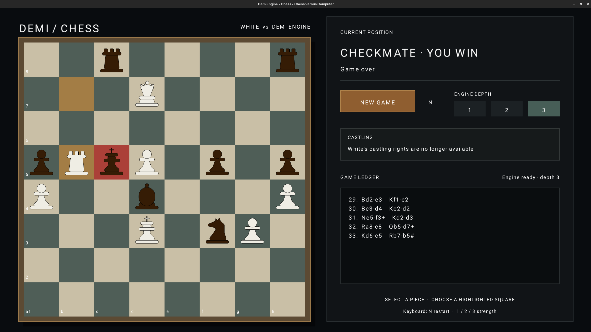
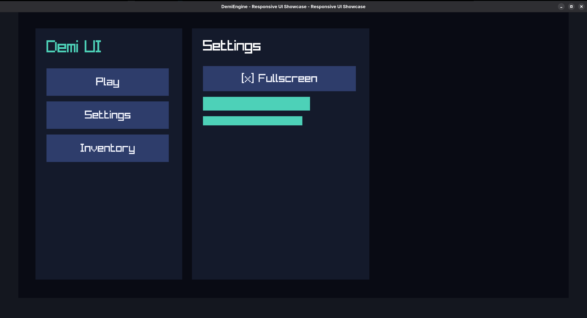
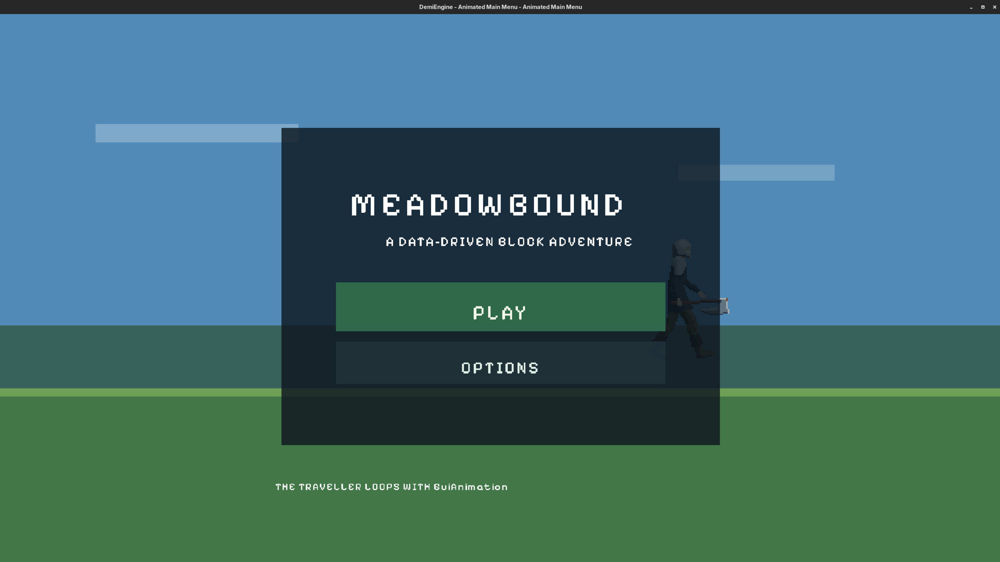
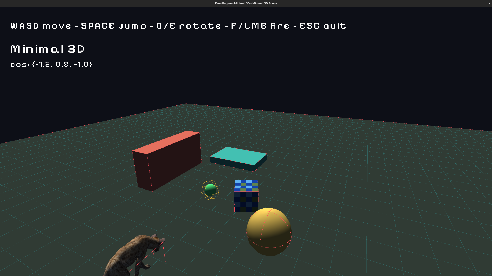
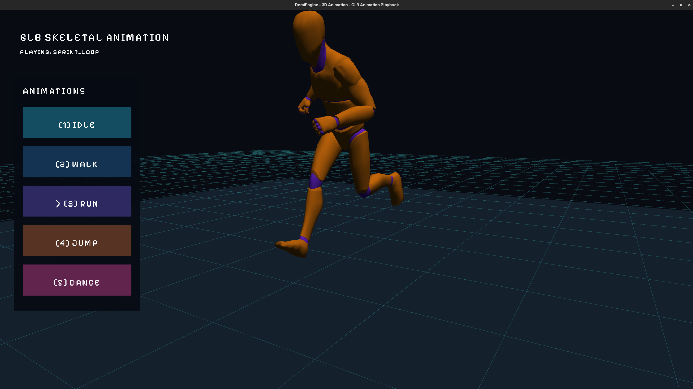
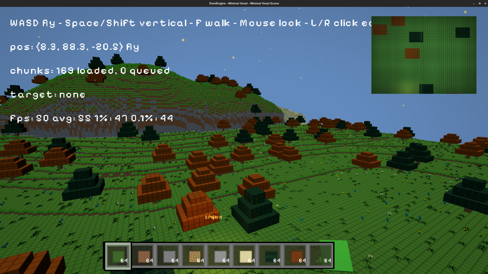

# DemiEngine

DemiEngine is a Linux-first C++20 game engine for deterministic, text-authored
games. Projects are versioned JSON, gameplay is Lua 5.4, and the command line
is the primary authoring, validation, testing, and packaging interface. Nothing
required to build a game is hidden in editor-only state.

The engine is aimed at finished 2D, isometric, 2.5D, UI-heavy, and data-heavy
games. Lightweight 3D and Android are usable experimental targets. High-end
Unity-style 3D and a full graphical editor are not current product targets.

## What Works Today

### Stable game-facing foundations

- Versioned projects, scenes, prefabs, HUD trees, assets, data, and saves.
- Lua lifecycle scripts, annotations, events, timers, hot reload, and generated
  LuaLS stubs.
- Vulkan-first bgfx rendering through a backend-neutral graphics device, with
  OpenGL and OpenGL ES backends available where supported.
- Production-oriented 2D sprites, cameras, animation, tilemaps, materials,
  startup-loaded game shaders, particles, masks, nine-slice rendering, and
  debug overlays.
- Box2D physics with multiple collider shapes, contacts, queries, joints, CCD,
  kinematic movement, and collider debug drawing that matches simulation.
- Contextual input actions for keyboard, mouse, gamepads, touch, gestures, and
  virtual controls, plus deterministic input replay.
- Retained tree UI with anchors, layout containers, focus/navigation, themes,
  localization, UI prefabs, text editing, virtualization, and accessibility
  snapshots.
- Schema-backed immutable game data and reusable Lua gameplay packages for
  controllers, health, projectiles, interactions, traversal, cameras,
  inventory, and encounters.
- Audio mixing, buses, snapshots, scheduling, streaming, spatial voices, and
  entity-attached sources behind a backend-neutral runtime API.
- Deterministic asset importing, dependency validation, portable `.demipack`
  archives, Linux cooking, and Linux runtime bundles.
- Profiling, CSV reports, deterministic replay, headless smoke tests, and
  capability compatibility gates.

### Experimental foundations

- Lightweight 3D rendering, glTF models and skeletal clips, materials, game
  shaders, lighting, shadows, particles, cameras, post effects, spatial
  queries, generated model colliders, and character movement.
- Host-authoritative networking with validated contracts, declared messages,
  server-issued entity IDs, ownership generations, bounded payload validation,
  late-join state, reconnect primitives, and a windowless dedicated server.
- Android debug APK packaging using the same project data and Lua gameplay as
  Linux.
- FFmpeg-backed video and cutscene playback when media support is enabled.

The precise support level of each subsystem is tracked in the
[capability matrix](docs/capabilities.md). Do not infer production support from
an example alone.

## Quick Start

Build the engine:

```sh
cmake --preset linux-debug
cmake --build --preset linux-debug
ctest --preset linux-debug
```

List the starter projects and create one:

```sh
./build/linux-debug/demi new --list
./build/linux-debug/demi new games/my_game \
  --template platformer --name "My Game"
```

Available templates currently include blank 2D, platformer, top-down,
isometric, lightweight 3D, networked game, and visual novel foundations.

Inspect the environment, validate the authored files, and run:

```sh
./build/linux-debug/demi doctor \
  --project games/my_game/demi.project.json
./build/linux-debug/demi validate games/my_game/demi.project.json
./build/linux-debug/demi run linux \
  --project games/my_game/demi.project.json --watch
```

`demi new` is transactional: it never overwrites an existing destination and
only publishes the generated directory after the project validates.

## Project Model

A project is a directory of inspectable source files:

```text
my_game/
├── demi.project.json
├── scenes/              # *.scene.json
├── prefabs/             # versioned entity prefabs
├── hud/                 # *.hud.json and UI prefabs
├── scripts/             # Lua gameplay modules
├── assets/              # *.asset.json manifests and source assets
├── data/                # schema-backed game data
└── tests/               # replay and project test fixtures
```

Every durable format includes `format_version`. References use stable URI-style
IDs such as `scene://main`, `prefab://player`, `asset://textures/player`, and
`script://scripts/player.lua`. Generated files belong in `build/`, `generated/`,
or an example's `generated/` directory.

The CLI, runtime, tests, and future editor consume the same files and
diagnostics. A project that only works because of unrecorded editor state is a
bug.

## Lua Gameplay

Scripts use explicit lifecycle methods and narrow engine services:

```lua
local Player = {}

function Player:on_start()
  self.speed = 6.0
end

function Player:on_update(dt)
  local x, y = Input.action_vector("move")
  Transform2D.add_position(
    self.entity_id,
    x * self.speed * dt,
    y * self.speed * dt
  )
end

return Player
```

Supported lifecycle methods are `on_create`, `on_start`, `on_update`,
`on_fixed_update`, and `on_destroy`. Public API declarations live in
[`scripts/stubs/demi.lua`](scripts/stubs/demi.lua) and can be copied for editor
tooling with:

```sh
demi lua-stubs generate generated/demi.lua
```

Gameplay should depend on services such as `Entity`, `Transform2D`,
`Transform3D`, `Input`, `Physics2D`, `Physics3D`, `HUD`, `Data`, `Save`,
`Audio`, `Events`, and `NetworkSession`, rather than raw C++ internals.

## Gameplay Packages

Reusable gameplay policy lives in optional Lua packages instead of engine
singletons. A project declares version constraints and a registry location or
URL in `demi.project.json`:

```json
{
  "format_version": 1,
  "package_registry": "../../packages",
  "packages": {
    "demi.gameplay.health": "^1.0.0",
    "demi.gameplay.projectiles": "^1.0.0"
  }
}
```

Resolve, update, inspect, and test packages through the CLI:

```sh
demi package install --project demi.project.json
demi package install --locked --offline --project demi.project.json
demi package update demi.gameplay.health --project demi.project.json
demi package list --project demi.project.json
demi package test packages/sources/demi.gameplay.health
```

Commit `demi.packages.lock.json`. The installed `.demi/packages/` directory and
download cache are derived state. The runtime never contacts a registry.
Available first-party packages are documented in
[`packages/README.md`](packages/README.md).

## Secure Multiplayer

Networking is optional at build time and experimental at the product level:

```sh
cmake --preset linux-debug -DDEMI_ENABLE_NETWORK=ON
cmake --build --preset linux-debug
```

A multiplayer project declares a versioned `NetworkContract` asset:

```json
{
  "format_version": 1,
  "network_contract": "asset://network/arena_contract"
}
```

The contract defines replicated prefabs and fields, who may write them,
message senders and recipients, ownership and disconnect rules, schemas,
reliability, rates, and resource limits. Its canonical compatibility hash is
checked during session setup.

Only the server issues network IDs and ownership changes. Incoming transport
bytes pass through fixed-header, contract, epoch, generation, sequence,
permission, rate, size, structure, finite-number, and schema validation before
Lua receives an event or the world changes.

```lua
NetworkSession.send("move_intent", player_network_id, {
  x = Input.action_value("move_x"),
  y = Input.action_value("move_y"),
})
```

`NetworkSession.emit` is legacy because it sent an undeclared generic network
event. This does **not** apply to `Events.emit`, which remains the supported
local event bus.

Run or package a windowless server with:

```sh
demi serve --project demi.project.json
demi build linux_server --project demi.project.json
```

Prediction, reconciliation, snapshot interpolation, delta baselines, lag
compensation, accounts, matchmaking, and host migration are not included in
the current networking layer. See [game-facing networking](docs/networking.md)
for the trust model and migration rules.

## Build, Test, and Package a Game

Common project commands:

```sh
demi validate demi.project.json
demi script check scripts/player.lua
demi test --project demi.project.json

demi run linux --project demi.project.json --profiler
demi build linux --project demi.project.json
demi build apk --project demi.project.json
demi cook --project demi.project.json --platform linux
```

Useful inspection and asset commands:

```sh
demi scene inspect scenes/main.scene.json
demi scene expand scenes/main.scene.json
demi prefab inspect prefabs/player.prefab.json

demi asset import hero.glb --project demi.project.json \
  --id asset://models/hero --preset animated_character
demi asset deps assets/models/hero.asset.json
demi asset collider assets/models/hero.asset.json \
  --project demi.project.json --id asset://colliders/hero --detail 0.8
demi asset budget demi.project.json --platform android
```

Use `demi --help` as the authoritative command list.

## Example Projects

Examples are executable engine probes, not throwaway snippets:

| Example | Purpose |
|---|---|
| `minimal_2d_android` | Shared Linux/Android 2D platform gameplay and virtual controls   |
| `minimal_2d_networking` | Menu flow, saves, scenes, platformer/slingshot gameplay, and networking integration |
| `production_2d_foundation` | Physics shapes, contacts, navigation, animation, and production 2D APIs |
| `isometric_base_builder` | Tower defense, placement, pathfinding, combat, targeting, and persistence  |
| `fighting_game_2d` | Local 2D fighting-game systems and animation-driven gameplay  |
| `chess` | Complete chess rules and a deterministic alpha-beta computer opponent  |
| `multiplayer_ffa_shooter` | Contract-backed host-authoritative shooter for Linux/Android packaging  |
| `ui_showcase` | Responsive retained UI, controls, layout, text input, and virtualization |
| `main_menu_animated` | UI animation and animated sprite presentation  |
| `main_menu_gif` | GIF wallpaper and SVG-driven mobile-style UI |
| `minimal_3d` | Lightweight 3D movement, queries, collisions, materials, and debug overlays  |
| `animation_3d` | glTF skeletal animation selection and playback  |
| `minimal_voxel` | Chunked voxel-style terrain, editing, particles, lighting, and profiling  |
| `saves_simulation_debugging` | Versioned saves, simulation, replay, and diagnostics |
| `minimal_2d_android_server` | Headless/server-oriented networking companion project |

When an example exposes a general gap, the fix belongs in the engine or a
reusable package—not as a private workaround in that example.

## Engine Development

Requirements for the default Linux build:

- CMake 3.22 or newer
- Ninja
- GCC 12+ or Clang 15+
- Lua 5.4 development files
- PkgConfig
- FFmpeg development packages when media is enabled

Primary presets:

```sh
cmake --preset linux-debug
cmake --build --preset linux-debug
ctest --preset linux-debug --output-on-failure

cmake --preset linux-release
cmake --build --preset linux-release

cmake --preset linux-asan
cmake --build --preset linux-asan
ctest --preset linux-asan --output-on-failure
```

The test suite covers CLI behavior, formats and validation, package resolution,
Lua bindings, UI, rendering, physics, audio, assets, scenes and resource
lifetime, networking security, deterministic failures, examples, Linux
bundles, Android APK packaging, and headless dedicated-server startup.

## Architecture

The main dependency direction is deliberate:

```text
CLI / application composition
  -> runtime subsystem contracts
    -> scene components and authored data
      -> platform and third-party adapters

Lua bindings -> public runtime services (never raw subsystem storage)
```

Notable boundaries:

- `src/demi/runtime/platform`: SDL3 window, lifecycle, input, and display APIs.
- `src/demi/runtime/render`: backend-neutral rendering plus bgfx adapters.
- `src/demi/runtime/physics`: Box2D and lightweight 3D collision/query systems.
- `src/demi/runtime/scene`: projects, scenes, prefabs, components, UI, and
  resource ownership.
- `src/demi/runtime/scripting`: Lua lifecycle, services, packages, and binding
  adapters.
- `src/demi/runtime/network`: transport boundary, contracts, ownership,
  validated messages, replication, lifecycle, and fault simulation.
- `src/demi/assets`, `src/demi/schema`, and `src/demi/diagnostics`: shared
  authored-data infrastructure used by both runtime and CLI.

Third-party integrations stay behind those boundaries so rendering, audio,
networking, and platform adapters can be replaced without rewriting game APIs.
See [architecture](docs/architecture.md) for more detail.

## Current Limitations

- Linux is the primary supported development and desktop platform.
- Android debug packaging works, but release signing, store delivery, and full
  device/lifecycle qualification are incomplete.
- Lightweight 3D is suitable for modest games, not high-end rendering or large
  editor-authored worlds.
- The editor executable is an architectural boundary, not a finished visual
  editor. Authoring remains text-and-CLI first.
- Networking establishes authority and validation, but advanced latency hiding
  and service infrastructure are future work.
- Android media and networking availability depends on the selected build
  configuration; validate the actual package rather than assuming desktop
  options carry over.

## Documentation

- [Getting started](docs/getting-started.md)
- [Capability matrix](docs/capabilities.md)
- [Architecture](docs/architecture.md)
- [CLI reference](docs/cli.md)
- [File formats](docs/file-formats.md)
- [Data assets](docs/data-assets.md)
- [Networking](docs/networking.md)
- [First-party gameplay packages](packages/README.md)
- [Capability and compatibility gates](docs/capability-gates.md)
- [Compatibility policy](docs/compatibility.md)
- [bgfx migration and renderer status](docs/bgfx-migration.md)
- [Development roadmap](plan.md)

## Repository Rules

- Keep public APIs small, explicit, serializable, and testable.
- Prefer stable IDs over positional references.
- Update a feature as a complete slice: data type, reflection, parsing,
  validation/schema, bindings, stubs, documentation, and tests.
- Treat example failures as evidence of a reusable engine or package gap.
- Validate edited projects and run focused regression tests before the full
  suite.
- Never hand-edit generated build output.
