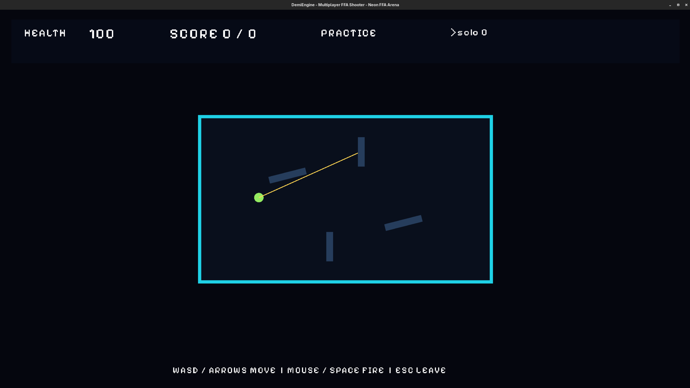

# DemiEngine

[Website](https://demiengine.de/) · [Free package catalog](https://demiengine.de/packages/) ·
[Getting started](docs/getting-started.md) · [Editor guide](docs/editor.md) ·
[Roadmap](plan.md)

DemiEngine is a Linux-first C++20 game engine for deterministic, text-authored
games. Projects are versioned JSON, gameplay is Lua 5.4, and the command line
is the primary authoring, validation, testing, and packaging interface. Nothing
required to build a game is hidden in editor-only state.

The established focus is 2D, isometric, 2.5D, UI-heavy, and data-heavy games.
Current development is expanding the experimental 3D engine: character scaling,
Jolt physics, localized destruction, and a native scene editor. Android shares
the runtime and authoring formats, with support qualified per feature and device.
This is not yet a production-ready replacement for a mature high-end 3D engine.

## What Works Today

### Stable game-facing foundations

- Versioned projects, scenes, prefabs, HUD trees, assets, data, and saves.
- Lua lifecycle scripts with explicit service imports, editor property annotations,
  events, timers, hot reload, and modular LuaLS stubs.
- Vulkan-first bgfx rendering through a backend-neutral graphics device, with
  OpenGL and OpenGL ES backends available where supported.
- Production-oriented 2D sprites, cameras, animation, tilemaps, materials,
  startup-loaded game shaders, particles, masks, nine-slice rendering, and
  debug overlays.
- Box2D physics with multiple collider shapes, contacts, queries, joints, CCD,
  kinematic movement, and collider debug drawing that matches simulation.
- Contextual input actions for keyboard, mouse, gamepads, touch, gestures, and
  virtual controls, plus deterministic input replay.
- Retained tree UI with anchors, layout containers, focus/navigation, themes,
  localization, UI prefabs, text editing, virtualization, and accessibility
  snapshots.
- Schema-backed immutable game data and reusable Lua gameplay packages for
  controllers, health, projectiles, interactions, traversal, cameras,
  inventory, and encounters.
- Audio mixing, buses, snapshots, scheduling, streaming, spatial voices, and
  entity-attached sources behind a backend-neutral runtime API.
- Deterministic asset importing, dependency validation, portable `.demipack`
  archives, locked `.demipkg` code/asset packages, cooking, and Linux runtime bundles.
- Profiling, CSV reports, deterministic replay, headless smoke tests, and
  capability compatibility gates.

### Experimental foundations

- 3D glTF models and skeletal clips, Vulkan GPU skinning with CPU fallback,
  instancing, culling, model/visual animation LOD, and repeatable crowd probes.
- Jolt rigid bodies, compound colliders, spatial queries, character movement,
  reusable collider assets, and collider generation from models.
- Component-based fracture authoring and native Blast/Jolt impacts, material
  density, connected fragment bodies, compact runtime masonry, proximity
  activation, debris cleanup, and optional destruction checkpoints.
- Opt-in mesh denting, height-map surface relief, textured materials, local and
  directional lights, tone-mapped panorama skies, mipmaps, particles, and post
  effects. HDR, metallic/roughness PBR, environment reflections, and local
  reflection probes are roadmap work, not delivered rendering features.
- A native editor with scene/HUD/prefab stages, hierarchy editing, Inspector,
  Undo/Redo, embedded Play, asset folders, diagnostics, profiling, and UI scaling.
- Host-authoritative networking with validated contracts, declared messages,
  server-issued entity IDs, ownership generations, bounded payload validation,
  late-join state, reconnect primitives, and a windowless dedicated server.
- Android APK/AAB build and signing workflows using the same project data and
  Lua gameplay as Linux; feature and device qualification remains scoped.
- FFmpeg-backed video and cutscene playback when media support is enabled.

The precise support level of each subsystem is tracked in the
[capability matrix](docs/capabilities.md). Do not infer production support from
an example alone.

## Quick Start

Build an optimized engine for playing examples and measuring performance:

```sh
cmake --preset linux-release
cmake --build --preset linux-release
```

List the starter projects and create one:

```sh
./build/linux-release/demi new --list
./build/linux-release/demi new games/my_game \
  --template platformer --name "My Game"
```

Available templates currently include blank 2D, platformer, top-down,
isometric, lightweight 3D, networked game, and visual novel foundations.

Inspect the environment, validate the authored files, and run:

```sh
cd games/my_game
../../build/linux-release/demi dev
# Or open the native editor:
../../build/linux-release/demi editor
```

`demi new` is transactional: it never overwrites an existing destination and
only publishes the generated directory after the project validates.

Commands below use `demi` for readability. Put `build/linux-release` on your
PATH or substitute the path to that executable. Use the Debug/ASan presets
under [Engine Development](#engine-development) for debugging and tests; Debug
performance is not representative of Release.

## Project Model

A project is a directory of inspectable source files:

```text
my_game/
├── demi.project.json
├── scenes/              # *.scene.json
├── prefabs/             # versioned entity prefabs
├── hud/                 # *.hud.json and UI prefabs
├── scripts/             # Lua gameplay; scripts/tests/e2e.lua for runtime tests
├── assets/              # *.asset.json manifests and source assets
├── data/                # schema-backed game data
├── demi.packages.lock.json # resolved package versions, when packages are used
└── .demi/               # derived installed packages and IDE metadata
```

Every durable format includes `format_version`. References use stable URI-style
IDs such as `scene://main`, `prefab://player`, `asset://textures/player`, and
`script://scripts/player.lua`. Generated files belong in `build/`, `generated/`,
or an example's `generated/` directory.

Prefer nested entity `children` for local hierarchies. Explicit transform
`parent` references remain useful for relationships across prefabs or scenes.
Startup `assets` entries are preloads, not an instruction to load every asset.
Scene references and explicit asset groups control resource residency.

The CLI, runtime, tests, and native editor consume the same files and
diagnostics. A project that only works because of unrecorded editor state is a
bug.

## Lua Gameplay

Scripts use explicit lifecycle methods and narrow engine services:

```lua
local Input = require("demi.input")
local Transform2D = require("demi.transform2d")

local Player = {}

function Player:on_start()
  self.speed = 6.0
end

function Player:on_update(dt)
  local x, y = Input.vector("move")
  Transform2D.add_position(
    self.entity_id,
    x * self.speed * dt,
    y * self.speed * dt
  )
end

return Player
```

Supported lifecycle methods are `on_create`, `on_start`, `on_update`,
`on_fixed_update`, and `on_destroy`. Public API declarations live in
[`scripts/stubs/demi/`](scripts/stubs/demi/). Inside a project, export the
annotation library to `.demi/lua/demi/` with:

```sh
demi lua-stubs generate
```

Each script imports only the services it uses. There are no implicit engine
globals or import-all module; local aliases are your choice. Related services
use dotted namespaces, such as `demi.physics.rigidbody3d` and
`demi.network.session`. Stubs are IDE metadata, not runtime modules. See
[explicit Lua imports](docs/lua-modules.md).

Use `@demi_component` and assignment-based `@demi_property` annotations for
editor-visible behavior, defaults, ranges, and references. Scene and prefab
`LuaScript.properties` contain the overrides. See [script properties](docs/script-properties.md).

Gameplay should depend on services such as `Entity`, `Transform2D`,
`Transform3D`, `Input`, `Physics2D`, `Physics3D`, `HUD`, `Data`, `Save`,
`Audio`, `Events`, and `NetworkSession`, rather than raw C++ internals.

## Packages and Assets

Browse the free [package catalog](https://demiengine.de/packages/). From a
directory containing `demi.project.json`, install a package with:

```sh
demi package add demi.gameplay.health@1.0.0
```

`--project` is optional in the project directory. The default registry is
`https://demiengine.de`; an explicit project registry, environment override, or
`--registry` can select another. Gameplay packages keep game policy outside
engine singletons. Asset packages export ready-to-select asset IDs without
manual extraction, reimporting, or copying files into the project.

For engine development, projects can use the repository's local registry:

```json
{
  "format_version": 1,
  "package_registry": "../../packages",
  "packages": {
    "demi.gameplay.health": "^1.0.0",
    "demi.gameplay.projectiles": "^1.0.0"
  }
}
```

Resolve, update, inspect, and test packages through the CLI:

```sh
demi package install --project demi.project.json
demi package install --locked --offline --project demi.project.json
demi package update demi.gameplay.health --project demi.project.json
demi package list --project demi.project.json
demi package test packages/sources/demi.gameplay.health
```

Commit `demi.packages.lock.json`. The installed `.demi/packages/` directory and
download cache are derived state. The runtime never contacts a registry.
See [available packages](packages/README.md), [asset streaming and package
content](docs/asset-streaming.md), and [authenticated publishing](tools/package-store/README.md).
The local [Kenney prototype texture package](packages/sources/kenney.textures.prototype/README.md)
contains 78 CC0 textures with original previews and license. Its source being
in this repository does not imply it has been published to the hosted catalog.

## Secure Multiplayer

Networking is included by default and remains experimental at the product level.
Including it does not host a server or connect automatically. To intentionally
build without it, configure with `-DDEMI_ENABLE_NETWORK=OFF`.

Existing build directories retain their cached setting; enable it explicitly
when updating a previously offline build:

```sh
cmake --preset linux-release -DDEMI_ENABLE_NETWORK=ON
cmake --build --preset linux-release
```

A multiplayer project declares a versioned `NetworkContract` asset:

```json
{
  "format_version": 1,
  "network_contract": "asset://network/arena_contract"
}
```

The contract defines replicated prefabs and fields, who may write them,
message senders and recipients, ownership and disconnect rules, schemas,
reliability, rates, and resource limits. Its canonical compatibility hash is
checked during session setup.

Only the server issues network IDs and ownership changes. Incoming transport
bytes pass through fixed-header, contract, epoch, generation, sequence,
permission, rate, size, structure, finite-number, and schema validation before
Lua receives an event or the world changes.

```lua
local Input = require("demi.input")
local NetworkSession = require("demi.network.session")

NetworkSession.send("move_intent", player_network_id, {
  x = Input.value("move_x"),
  y = Input.value("move_y"),
})
```

`NetworkSession.emit` is legacy because it sent an undeclared generic network
event. This does **not** apply to `Events.emit`, which remains the supported
local event bus.

Run or package a windowless server with:

```sh
demi serve --project demi.project.json
demi build linux_server --project demi.project.json
```

Sequenced owner inputs, prediction/reconciliation, bounded snapshot
interpolation, and detached historical 2D hit queries are available for
latency-sensitive action controllers. Delta-compression baselines, accounts,
matchmaking, and host migration are not included. See
[game-facing networking](docs/networking.md) for the trust model and APIs.

## Build, Test, and Package a Game

Common project commands:

```sh
demi validate demi.project.json
demi script check scripts/player.lua
demi test --project demi.project.json

demi run linux --project demi.project.json --profiler
demi build linux --project demi.project.json
demi build apk --project demi.project.json
demi cook --project demi.project.json --platform linux
```

Useful inspection and asset commands:

```sh
demi scene inspect scenes/main.scene.json
demi scene expand scenes/main.scene.json
demi prefab inspect prefabs/player.prefab.json

demi asset import hero.glb --project demi.project.json \
  --id asset://models/hero --preset animated_character
demi asset deps assets/models/hero.asset.json
demi asset collider assets/models/hero.asset.json \
  --project demi.project.json --id asset://colliders/hero --detail 0.8
demi asset budget demi.project.json --platform android
```

Use `demi --help` as the authoritative command list.

## Example Projects

Examples are executable engine probes, not throwaway snippets:

| Example | Purpose |
|---|---|
| `minimal_2d_android` | Shared Linux/Android 2D platform gameplay and virtual controls   |
| `production_2d_foundation` | Physics shapes, contacts, navigation, animation, and production 2D APIs |
| `isometric_base_builder` | Tower defense, placement, pathfinding, combat, targeting, and persistence  |
| `fighting_game_2d` | Local 2D fighting-game systems and animation-driven gameplay  |
| `chess` | Complete chess rules and a deterministic alpha-beta computer opponent  |
| `multiplayer_ffa_shooter` | Contract-backed host-authoritative shooter for Linux/Android packaging  |
| `ui_showcase` | Responsive retained UI, controls, layout, text input, and virtualization |
| `main_menu_animated` | UI animation and animated sprite presentation  |
| `main_menu_gif` | GIF wallpaper and SVG-driven mobile-style UI |
| `asset_streaming_showcase` | Optional group load, progress, cancellation, reload, unload, transitive dependencies, and backend memory ownership |
| `minimal_3d` | Lightweight 3D movement, queries, collisions, materials, and debug overlays  |
| `animation_3d` | glTF skeletal animation selection and playback  |
| [performance_3d_lab](examples/performance_3d_lab/README.md) | Rigid-body scaling, barrel towers, projectile impacts, and mesh denting |
| [destruction_weapons_3d_lab](examples/destruction_weapons_3d_lab/README.md) | Hammer/rocket damage, breakable masonry and door hinges, streamed damage state, sky and prototype textures |
| [fracture_prefab_lab](examples/fracture_prefab_lab/README.md) | Component-based fracture authoring in ordinary prefabs |
| [destruction_3d_lab](examples/destruction_3d_lab/README.md) | Compound collision, part queries, bonds, and native splitting probes |
| [physics_2d_galton_board](examples/physics_2d_galton_board/README.md) / [physics_3d_galton_board](examples/physics_3d_galton_board/README.md) | Collision-preserving 2D and Jolt 3D ball simulations |
| [third_person_foundation](examples/third_person_foundation/README.md) | Camera-relative movement, orbit, stamina, rolls, and melee timing |
| `procedural_spider_3d` | Terrain-aware eight-legged locomotion using raycast foot placement and runtime two-bone IK |
| `minimal_voxel` | Chunked voxel-style terrain, editing, particles, lighting, and profiling  |
| `saves_simulation_debugging` | Versioned saves, simulation, replay, and diagnostics |
| `minimal_2d_android_server` | Headless/server-oriented networking companion project |

When an example exposes a general gap, the fix belongs in the engine or a
reusable package—not as a private workaround in that example.

### Try the destruction lab

From the repository root:

```sh
demi package install --project examples/destruction_weapons_3d_lab
demi run --project examples/destruction_weapons_3d_lab
# To inspect and edit its scene:
demi editor --project examples/destruction_weapons_3d_lab
```

Click to capture the mouse, WASD to move, LMB for the hammer, RMB for a rocket,
F to refill, R to reset, and Tab to release the cursor. Scene setup stays in
`main.scene.json`; the walls use a compact shared prefab. Read the
[fracture authoring](docs/fracture-authoring.md), [spatial impacts](docs/3d-spatial-impacts.md),
and [streamed destruction](docs/streamed-destruction.md) guides for the engine APIs
and current limits. Blast runs alongside Jolt without requiring an NVIDIA GPU,
CUDA, or PhysX.

### Show 1,024 or 2,000 animated characters

From the repository root, after building Release:

```sh
python3 scripts/benchmark_3d_visible.py \
  --binary build/linux-release/demi \
  --output "build/crowd-demo-$(date +%Y%m%d-%H%M%S)" \
  --counts 1024 --workloads animated --skinning gpu \
  --vsync on --seconds 300 \
  --width 1920 --height 1080
```

Change `--counts 1024` to `--counts 2000` for the larger demo, or use
`--width 2560 --height 1440` for 1440p. The runner adjusts the camera in a temporary
project and closes after five minutes. Timestamped output folders preserve
previous results; reusing an existing folder is rejected. Run one demo at a time.

This shows independently phased walk animations, not thousands of AI agents or
character collisions. `--skinning gpu` requests and verifies the GPU path on the
supported Vulkan rig. Performance depends on the scene, hardware, resolution,
and build. See the [animation example](examples/animation_3d/README.md),
[GPU skinning](docs/3d-gpu-skinning.md), and
[Milestone 2 qualification](docs/3d-milestone-2-qualification.md) for measured
workloads and limitations. The demo command is not the qualification protocol.

## Engine Development

Requirements for the default Linux build:

- CMake 3.22 or newer
- Ninja
- GCC 12+ or Clang 15+
- Lua 5.4 development files
- PkgConfig
- FFmpeg development packages when media is enabled

Primary presets:

```sh
cmake --preset linux-debug
cmake --build --preset linux-debug
ctest --preset linux-debug --output-on-failure

cmake --preset linux-release
cmake --build --preset linux-release

cmake --preset linux-asan
cmake --build --preset linux-asan
ctest --preset linux-asan --output-on-failure
```

The test suite covers CLI behavior, formats and validation, package resolution,
Lua bindings, UI, rendering, physics, audio, assets, scenes and resource
lifetime, networking security, deterministic failures, examples, Linux
bundles, Android APK packaging, and headless dedicated-server startup.

## Architecture

The main dependency direction is deliberate:

```text
CLI / application composition
  -> runtime subsystem contracts
    -> scene components and authored data
      -> platform and third-party adapters

Lua bindings -> public runtime services (never raw subsystem storage)
```

Notable boundaries:

- `src/demi/runtime/platform`: SDL3 window, lifecycle, input, and display APIs.
- `src/demi/runtime/render`: backend-neutral rendering plus bgfx adapters.
- `src/demi/runtime/physics`: Box2D and Jolt simulation, collisions, and queries.
- `src/demi/runtime/destruction`: Blast-backed damage, splitting, and checkpoints.
- `src/demi/runtime/scene`: projects, scenes, prefabs, components, UI, and
  resource ownership.
- `src/demi/runtime/scripting`: Lua lifecycle, services, packages, and binding
  adapters.
- `src/demi/runtime/network`: transport boundary, contracts, ownership,
  validated messages, replication, lifecycle, and fault simulation.
- `src/demi/assets`, `src/demi/schema`, and `src/demi/diagnostics`: shared
  authored-data infrastructure used by both runtime and CLI.

Third-party integrations stay behind those boundaries so rendering, audio,
networking, and platform adapters can be replaced without rewriting game APIs.
See [architecture](docs/architecture.md) for more detail.

## Current Limitations

- Linux is the primary supported development and desktop platform.
- Android has debug and signed release packaging paths, but device coverage,
  sustained performance, and store delivery still require project-specific testing.
  See [shipping](docs/shipping.md) for signing and target restrictions.
- 3D remains experimental. The tone-mapped sky is not HDR lighting; full PBR,
  reflections, qualified shadows, and landscape-scale workflows remain unfinished.
- Destruction supports localized bonded fragments and runtime masonry, not
  arbitrary recursive slicing or a complete structural stress/collapse system.
  Cold generation is synchronous; large-world performance is not implied by
  the proximity-streaming API.
- The native editor supports 2D/3D/HUD previews, prefab editing and embedded Play,
  but is still evolving. See [editor status](docs/editor.md); use
  **Edit → Editor Settings → UI scale** for high-DPI screens.
- Networking includes prediction/reconciliation primitives, not hosted accounts,
  matchmaking, or a complete multiplayer backend service.
- Validate the actual shipping target. Android intentionally excludes some
  desktop features such as FFmpeg media and runtime SVG decoding.

## Documentation

- [Getting started](docs/getting-started.md)
- [Capability matrix](docs/capabilities.md)
- [Architecture](docs/architecture.md)
- [Editor](docs/editor.md)
- [CLI reference](docs/cli.md)
- [File formats](docs/file-formats.md)
- [Explicit Lua modules and modular stubs](docs/lua-modules.md)
- [Script properties and editor annotations](docs/script-properties.md)
- [Data assets](docs/data-assets.md)
- [Networking](docs/networking.md)
- [First-party gameplay packages](packages/README.md)
- [Asset streaming and package content](docs/asset-streaming.md)
- [Package store and publishing](tools/package-store/README.md)
- [Rendering, panorama skies, and effects](docs/rendering-and-effects.md)
- [3D gameplay](docs/3d-gameplay.md)
- [Collider assets](docs/collider-assets.md)
- [GPU skinning](docs/3d-gpu-skinning.md)
- [3D scaling qualification](docs/3d-milestone-2-qualification.md)
- [Mesh denting](docs/mesh-denting.md)
- [Fracture authoring](docs/fracture-authoring.md)
- [Destruction runtime](docs/3d-destruction-runtime.md)
- [Spatial impacts](docs/3d-spatial-impacts.md)
- [Streamed masonry and destruction saves](docs/streamed-destruction.md)
- [Linux/Android shipping](docs/shipping.md)
- [Capability and compatibility gates](docs/capability-gates.md)
- [Compatibility policy](docs/compatibility.md)
- [bgfx migration and renderer status](docs/bgfx-migration.md)
- [Development roadmap](plan.md)

## Repository Rules

- Keep public APIs small, explicit, serializable, and testable.
- Prefer stable IDs over positional references.
- Update a feature as a complete slice: data type, reflection, parsing,
  validation/schema, bindings, stubs, documentation, and tests.
- Treat example failures as evidence of a reusable engine or package gap.
- Validate edited projects and run focused regression tests before the full
  suite.
- Never hand-edit generated build output.
