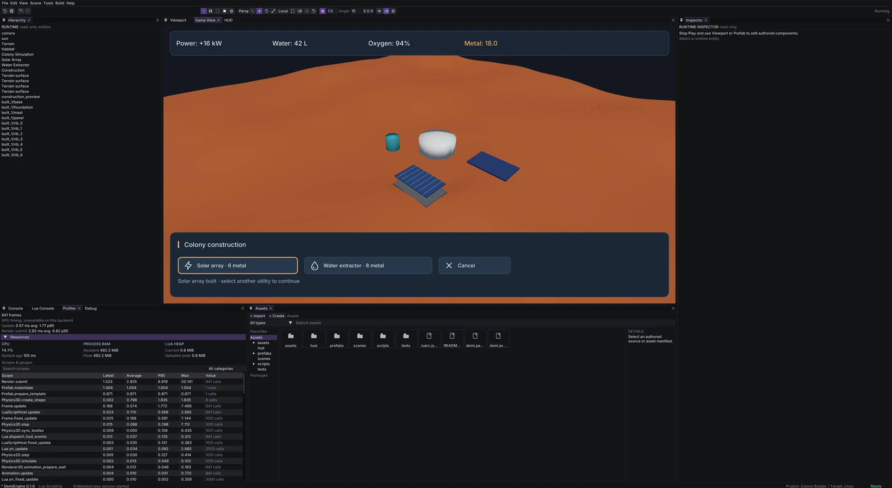

# Colony construction editor probe

Qualified 2026-10-10 on Linux, native SDL/bgfx Vulkan. Source is
examples/colony_builder; it remains an experimental lightweight-3D game probe.

## Playable slice

Orbit 1.1.0 supplies the anchored construction panel and icon buttons. Players
choose solar arrays or water extractors, inspect a snapped green/red footprint,
and click clear terrain to build. Placement samples actual physics terrain,
rejects overlap, steep normals, edges and height variation above 1.25 m, and
extends foundation geometry down to sampled low ground. Costs are charged only
when prefab creation is accepted. New utilities feed the existing power/water/
oxygen simulation and disabled roots stop contributing. Rules remain in Lua;
reusable visual hierarchies live in ordinary authored utility prefabs.

The camera was edited and saved through the native Inspector. In embedded Play,
a manually placed solar array reduced metal from 24 to 18 and increased the
power balance from +4 to +16 kW. Native captures used a maximized 5120 x 2806
editor on the 5120 x 2880 display; X11 was only an automation choice.

## Engine and documentation findings

Decorative UI panels could not block world clicks independently of keyboard
focus. The shared UI model now supports blocks_pointer, default false. The
runtime parser, post-composition validation, schema, Lua definition annotations,
CLI inspect report and HUD Inspector agree. Existing pointer routing applies
ancestor visibility, scroll clipping and front-to-back control ordering.

CLI HUD inspection bypassed prefab and theme resolution; it now uses the shared
HUD loader before producing its layout report, with a CLI fixture covering theme
geometry, generated children and invalid overrides.

The physics-query docs used named vector fields for array-valued camera rays;
the example now uses numeric indices. Inspector fields shifting when the Unsaved
line appears is recorded in tofix.md as a noncritical authoring issue.

## Verification and limits

- Four focused CTests pass: ui, ui-step3, editor-hud-document and hud-inspect-cli. They cover
  pointer/focus separation, decorative passthrough, parsing and validation through
  prefab overrides, alongside existing HUD editing regressions.
- Project validation checks 91 reachable files without diagnostics.
- Real runtime E2E passes from source headlessly, and from Linux cooked output
  headlessly and visibly at 5120 x 2806. It covers baseline resource production,
  power failure/recovery, cancellation, occupied-site rejection, material costs,
  multiple utility prefabs, supply/demand changes and insufficient funds.
- Maintained HUD/physics docs were deployed after Composer checks, Twig lint and
  cache warmup. No platform-specific runtime code was introduced.

This does not qualify Windows/Android or the full engine test suite. Construction
is immediate and session-local. Physical utility connections, hauling/build jobs,
autonomous colonists and persistence remain future gameplay work. Original starter
assets remain in the project; the colony scene is its entry point.
