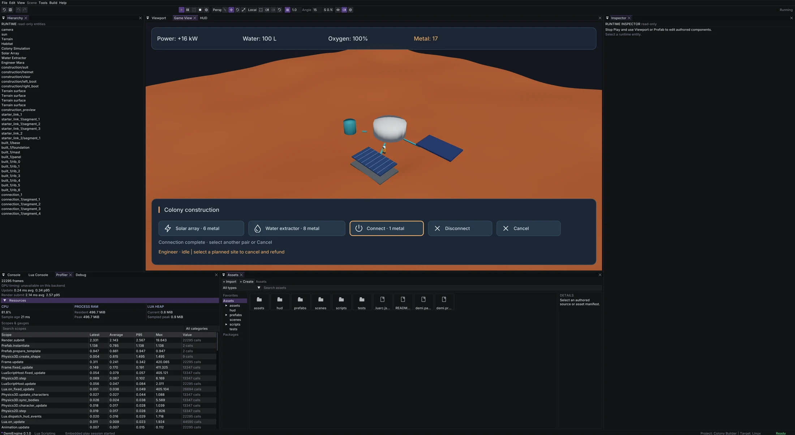

# Colony connections and ground-agent qualification

Qualified 2026-10-10 on Linux with the native SDL/bgfx Vulkan editor.

## Shared navigation and agent ownership

The native demi.navigation service replaces demi.navigation2d. create_grid owns
an independent NavigationGrid2D instance; default_grid explicitly accesses the
world grid used by Tilemap and debug visualization. A* and its existing blockers,
weighted costs and deterministic traversal remain in the shared native algorithm.
The Lua interface uses grid methods rather than one implicit mutable global grid.
Invalid dimensions/nonfinite coordinates and costs reject without corrupting a
configured grid. Runtime controllers, examples, LuaLS metadata and public guides
have been migrated; there is no legacy module alias.

The new demi.navigation.ground 0.1.0 package builds on independent grids and the
native CharacterController3D. Terrain surveys are incremental and path requests
remain unavailable until the survey completes. Dynamic footprints revise the
routes; terrain/static collision changes can invalidate a survey. Actors pause
when disabled, stop during resurvey, report stalls/unreachable routes and never
teleport to complete jobs. Character collision and gravity remain engine-owned.
Ground movement is heightfield X/Z navigation, not a multilevel navmesh or crowd
avoidance. Multiple actors can share one surface; this gameplay probe uses one.

Obsolete provenance-marked native LuaLS modules are removed after a successful
stub export. Unmanaged annotations and existing .luarc settings remain untouched.
This prevents the removed navigation2d module from lingering in editor completion.

## Colony gameplay ownership

The authored simulation component coordinates separate resource, construction,
utility-network and job modules. The existing construction placement ID now owns
an ordinary engineer prefab with the stable engineer body ID. Network entries
retain stable building IDs across site completion. Planned sites reserve metal;
cancellation refunds it. The engineer follows a collision-aware route to an
adjacent cell and works before the final prefab appears. Resources depend on
completed, enabled conduits reaching the habitat, including transitive links.
Disabled bridges disconnect downstream utilities and recover when re-enabled.

Links cost one metal, have a 28 m limit and reject obstructed/steep routes.
Pending links do not carry service; cancellation refunds them, while removing a
completed link spends no additional metal and returns no material. Job policy is
FIFO and blocked routes wait/retry. Physical hauling and colonist needs are not
implemented; construction remains session-local without saves.

## Evidence

Six focused CTests pass: navigation2d, lua-stub-contract, lua-scripting,
editor-imgui-input, editor-source-workflow and navigation-ground-package. The
package check contains four cases covering bounded survey work, copied obstacle
inputs, stalls, disabled actors, resurvey/replan and invalid or missing inputs.
Native Lua checks prove independent grids do not alter the Tilemap/default grid.
The migrated production_2d_foundation validates and passes a headless startup.
The colony validates 93 reachable files without diagnostics.

The real colony E2E covers the original life-support failures plus disabled
engineers, bounded walking, deferred completion, costs/refunds, disconnected
production, duplicate links, reconnection, transitive supply and insufficient
materials. Source and cooked checks pass both headlessly and visibly at 5120 x 2806.
These are scoped checks, not a full engine-suite or other-platform qualification.

Native editor captures verified a marked work site, walking/building status and
a completed solar array that remained disconnected at +4 kW. The engineer then
completed its conduit and power rose to +16 kW with 17 metal remaining. The
updated HUD reports completion rather than retaining an obsolete queued message.

## Viewport regression

The right-button rotation report was handled separately in commit 16359b4.
The editor now accumulates relative captured motion before submitting pointer
coordinates to ImGui. The user confirmed continuous rotation after rebuilding;
temporary tracing was removed. See editor-shortcut-qualification.md for the
input regression evidence. This is platform-neutral SDL/editor code.

## Published package

Ground Navigation 0.1.0 and the updated navigation guides are published in store
release 20261010-122353-ground-agents. Composer checks, all 105 Twig templates,
production cache warmup and health passed. Hosted Ground and Orbit archives match
the tested staging hashes, and the colony installs both from the public registry
with its committed lockfile. Previously published packages were not overwritten.
