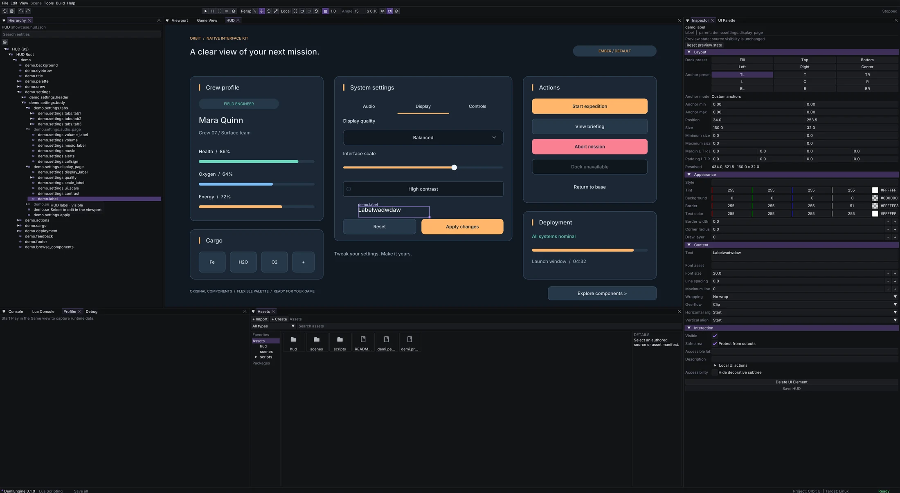
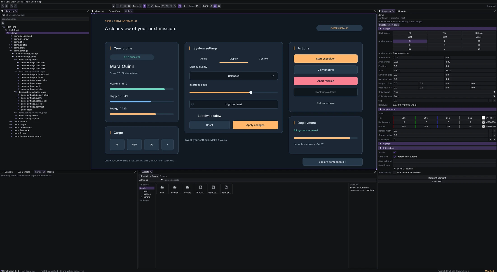

# UI and entity prefab authoring qualification

Qualified 2026-10-10 on Linux with the native SDL/bgfx Vulkan editor.

## Ownership and saved contracts

The runtime UI prefab resolver owns target-based overrides, source provenance,
local additions, removal and parent resolution. The editor caches that provenance
and writes reversible authored commands; it does not copy a second prefab model.
One overrides map uses $root or prefab-local descendant IDs. Local additions and
parent/action references in patches use host-document IDs. Reparenting preserves
identity and records inherited parent changes without detaching the instance.

HUD and scene Unpack commands resolve the owning instance, including nested
prefabs, preserve IDs and current authored overrides, and leave shared files alone.
UI content moved outside its source instance is retained when unpacking; foreign
content moved into it retains its own source ownership. Scene unpacking uses the
shared composition resolver with procedural preview generation disabled.

Node-owned declarative actions drive authoring tab previews and runtime behavior.
Preview visibility is outside saved state and history and is not baked by Unpack.
Canvas picking and palette drops respect ancestor visibility and scroll clips;
transparent layout containers remain valid drop destinations.

The shared authored JSON patcher replaces empty-container whitespace when adding
its first member, avoiding blank indented lines when moving the last override.

## Automated evidence

Ten focused CTest checks pass: editor-hud-flow-placement, editor-prefab-components,
editor-hud-hierarchy, editor-hud-document, authored-json-patch, ui-orbit-package,
ui-canvas-renderer, lua-scripting, ui and ui-step3. These cover generated property
editing, mapped entity IDs, local and inherited reparenting, cross-instance cycles,
removal, reset, unpack, Undo/Redo, save/reopen, source isolation, visible drop
selection and action cloning. This is a scoped gate, not a full-suite claim.

Orbit package tests: 4 passed. Orbit validates 84 reachable files; the colony
prototype and minimal_3d also validate without diagnostics. Orbit's real E2E suite
passes headlessly and visibly at 5120 x 2806, and passes visibly from the Linux
cooked project. Package metadata generation check and git diff --check pass.

## Native evidence

The editor ran maximized at 5120 x 2806 on the external 5120 x 2880 monitor.
X11 was selected only for xdotool input and window capture; no engine platform
workaround was added. Windows and Android were not qualified here.

- Dragged the user's demo.label from Audio to demo.settings.display_page using
  Hierarchy. Its stable ID and Labelwadwdaw text survived the move and Save.
- Clicked Display in the HUD canvas and verified the label became visible.
- Unpacked demo in Inspector and verified unchanged appearance and ordinary
  editable nodes; Undo restored its prefab link and retained the label's move.
- Dropped a temporary palette label on Display and verified its parent was
  demo.settings.display_page rather than hidden Audio. Undid that test addition.

The user's label customization remains an uncommitted example change. The colony
prototype and its original stash backup remain available.

## Published state

Orbit 1.1.0 and maintained authoring docs are live in store release
20261010-111304-ui-authoring. Server Composer checks, README/catalog checks,
105 Twig templates and production cache warmup passed before activation.
Health returned OK; the public package matches the tested local archive, and
public locked installation succeeded. Previously published archives remain intact.
